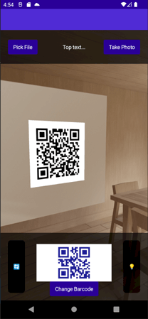
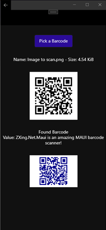
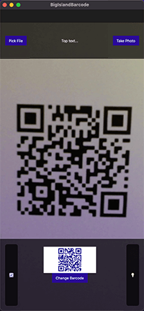

# ZXing.Net.Maui.Jgdev
[](https://www.nuget.org/packages/ZXing.Net.Maui.Jgdev/)

The successor to ZXing.Net.Mobile, providing barcode generation and scanning from a camera or files - and all cross platform! _(except windows - see below)_

A fork of [Redth/BigIslandBarcoding](https://github.com/Redth/BigIslandBarcoding), with code reworks and improvements _(in my opinion)_

Android<br/>(Camera Scanning) | Windows<br/>(File Scanning) | Mac/iOS<br/>(Camera Scanning)
:-:|:-:|:-:
 |  | 

## Support

Platform | Min. Version | Barcode Generating | Camera Scanning | File Scanning
--- | --- | --- | --- | ---
Android | 12 (API 31) | ✔ | ✔ | ✔
iOS | 10 | ✔ | ❌<b>*</b> | ✔
macOS | 14 | ✔ | ✔ | ✔
Windows | 11 OR 10 (> 1809) | ✔ | ❌<sup>**Ŧ**</sup> | ✔

<sup>**Ŧ**</sup> <small>_There is no MAUI support for the camera yet. We are monitoring CommunityToolkit/Maui#259 - For now, Windows just loads a black screen, you will need to detect/redirect_</small>

<b>*</b> <small>_IOS version doesn't work (see [#1](https://github.com/julienGrd/BigIslandBarcoding/issues/1)). I can't test the IOS version so please investigate and submit a PR if you are able to correct it._</small>

## Usage

### Barcode Scanning

```xaml
<zxing:CameraBarcodeReaderView 
    x:Name="cameraBarcodeReaderView"
    BarcodesDetected="BarcodesDetected" />
```

**Scanning options/features**
```csharp
// Configure Reader options
cameraBarcodeReaderView.Options = new BarcodeReaderOptions
{
    Formats = BarcodeFormats.OneDimensional,
    AutoRotate = true,
    Multiple = true
};
    
// Handle detected barcode(s)
protected void BarcodesDetected(object sender, BarcodeDetectionEventArgs e)
{
    foreach (var barcode in e.Results)
        Console.WriteLine(
            $"Barcodes: {barcode.Format} -> {barcode.Value}"
        );
}

// Toggle Torch
cameraBarcodeReaderView.IsTorchOn = !cameraBarcodeReaderView.IsTorchOn;

// Flip between Rear/Front cameras
cameraBarcodeReaderView.CameraLocation = 
    cameraBarcodeReaderView.CameraLocation == CameraLocation.Rear 
        ? CameraLocation.Front 
        : CameraLocation.Rear;
```

### Barcode Generator View
```xaml
<zxing:BarcodeGeneratorView
    HeightRequest="100"
    WidthRequest="100"
    ForegroundColor="DarkBlue"
    Value="https://dotnet.microsoft.com"
    Format="QrCode"
    Margin="3" />
```

### Image Stream Scanning

We also support scanning file streams 

```CSHARP
// To pick a photo from storage
var result =
    await FilePicker.PickAsync(new()
        {
            FileTypes = FilePickerFileType.Images,
            PickerTitle = "Choose your barcode"
        }
    );

// To take a photo
var result = 
    await MediaPicker.Default.CapturePhotoAsync(new()
        {
            Title = "Take a photo of the barcode"
        }
    );

// Use the result, if there is one
if (result != null)
{
    using var stream = await result.OpenReadAsync();

    var reader =
        new ZXingBarcodeReader
        {
            Options = new BarcodeReaderOptions
            {
                Formats = BarcodeFormats.All,
                AutoRotate = true
            }
        };

    var results = reader.Decode(stream);
    
    foreach (var barcode in results)
        Console.WriteLine(
            $"Barcodes: {barcode.Format} -> {barcode.Value}"
        );
}
```
